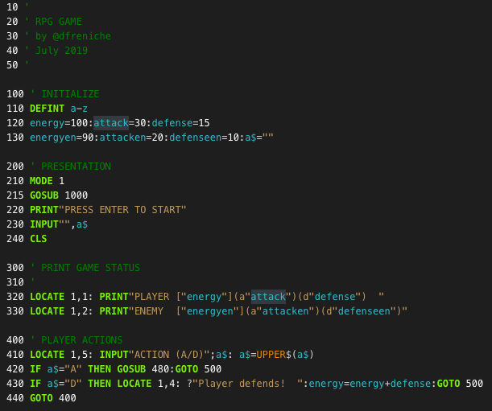
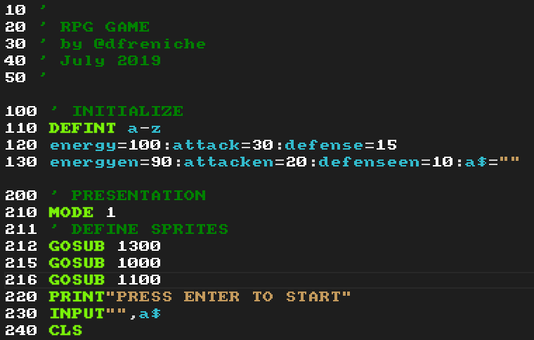

# AMSTRAD CPC - Basic README

LOCOMOTIVE SOFTWARE AMSTRAD CPC BASIC syntax highlighting for Visual Studio Code.

Supports all reserved words from the AMSTRAD CPC Locomotive BASIC range.




Best results when also using a [CPC font](https://fonts2u.com/download/amstrad-cpc464-regular.font) ;-)



## Basic

### Statements

```text
AFTER, AUTO, BORDER, BREAK, CALL, CAT, CHAIN MERGE, CHAIN, CLEAR, CLG, 
CLOSEIN, CLOSEOUT, CLS, CONT, DATA, DEF FN, DEFINT, DEFSTR, DEFREAL, DEG, 
DELETE, DI, DIM, DRAW, DRAWR, EDIT, EI, ELSE, END, ENT, ENV, ERASE, ERROR, 
EVERY, FOR, GOSUB, GOTO, IF, INK, INPUT, KEY DEF, KEY, LET, LINE INPUT, LIST, 
LOAD, LOCATE, MEMORY, MERGE, MODE, MOVE, MOVER, NEW, NEXT, ON, OUT, OPENIN, 
OPENOUT, ORIGIN, PAPER, PEN, PLOT, PLOTR, POKE, PRINT, SPC, TAB, USING, RAD, 
RANDOMIZE, READ, RELEASE, RENUM, RESTORE, RESUME, RETURN, RUN, SAVE, SOUND, 
STEP, SPEED, SYMBOL, SWAP, TAG, TAGOFF, TRON, TROFF, THEN, TO, STEP, STOP, 
UNT, WAIT, WEND, WHILE, WIDTH, WINDOW, WRITE, ZONE
```

### Functions

```text
ABS, ASC, ATN, BIN, CHR$, CINT, CREAL, COS, EOF, ERR, ERL, EXP, FIX, FRE, 
HIMEM, INKEY, INKEY, INP, INTRS, INT, JOY, LEFT, LEN, LOG10, LOG, LOWER, MIN, 
MAX, MID, PEEK, PI, POS, REMAIN, RIGHT, RND, ROUND, SIN, SQ, SQR, STR$, STRING$, 
SGN, TAN, TEST, TESTR, TIME, UPPER, VAL, XPOS, YPOS
```

### Operators

```text
AND, NOT, OR, XOR, MOD
```

## Installation

Launch VS Code Quick Open (**Ctrl+P**), paste the following commnand, and press Enter.

```vscode
ext install amstradbasic
```

## Theme colors

To change the colors to your liking, just edit `settings.json` global file and add:

```
"editor.tokenColorCustomizations": {
        "textMateRules": [
                {
                    "scope": [
                    "keyword.control.amstradbasic"
                    ],
                    "settings": {
                        "foreground": "#79f109",
                        "fontStyle": "bold"
                    }
                },
                {
                    "scope": [
                        "entity.name.function.amstradbasic",
                    ],
                    "settings": {
                        "foreground": "#e98707"
                    }
                },
                {
                    "scope": [
                    "comment.line.amstradbasic",
                    ],
                    "settings": {
                        "foreground": "#008000",
                    }
                },
                {
                    "scope": [
                        "keyword.operator.logical.amstradbasic"
                    ],
                    "settings":{
                        "foreground": "#8E8E8E",
                    }
                },
                
                
                {
                    "scope": [
                        "variable.name.amstradbasic"
                    ],
                    "settings": {
                        "foreground": "#32bacc"
                    }
                },
                {
                    "scope": [
                        "constant.numeric.amstradbasic"
                    ],
                    "settings": {
                        "foreground": "#ffffff"
                    }
                },
                {
                    "scope": [
                        "string"
                    ],
                    "settings": {
                        "foreground": "#c2995c"
                    }
                }
                
        ]
    }
```


## Acknowledgments

- This is just a port of the awesome [ZX-Basic](https://github.com/jsanjose/zxbasic-vscode) extension
- The image [`Locomotive_BASIC_amstrad_cpc`](https://en.wikipedia.org/wiki/Locomotive_BASIC#/media/File:Locomotive_BASIC_amstrad_cpc.PNG) was taken from Wikipedia and is released under Public Domain License
